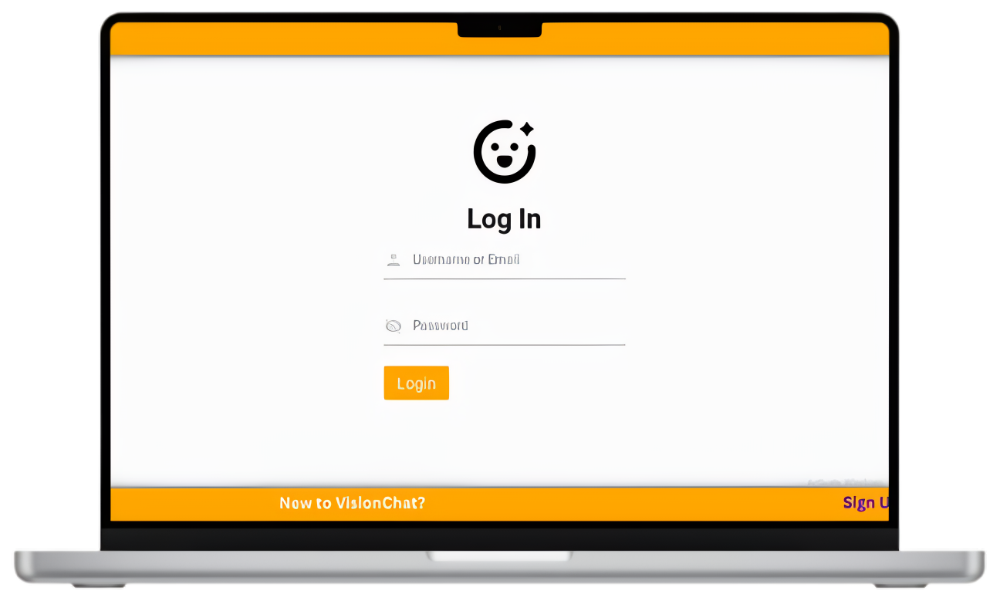
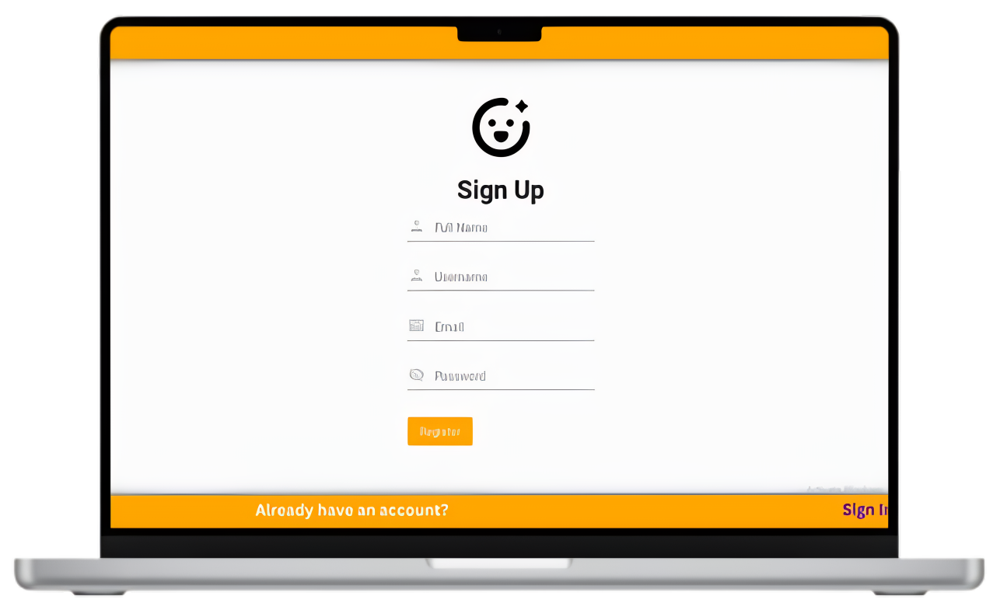
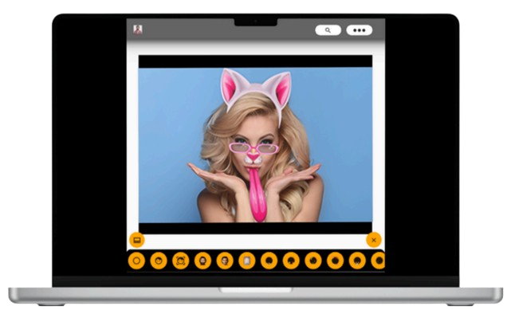
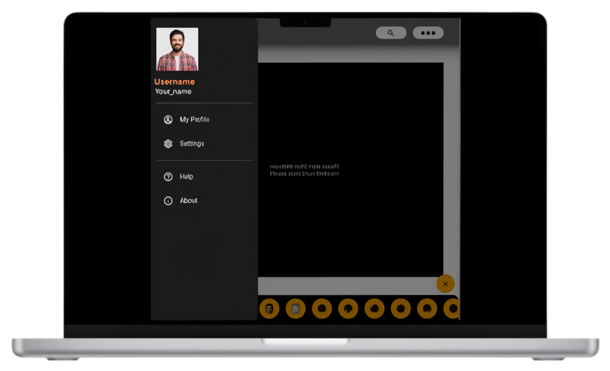
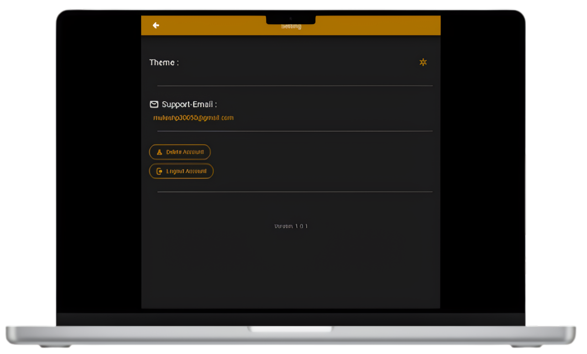

# VisionChat

> **VisionChat** is a Windows‑based desktop application that mixes real‑time computer‑vision wizardry with secure, low‑latency chatting. Wave your hand to pop balloons, swap your face with Iron Man’s helmet, control your system volume with a pinch gesture, or just jump into a text/video chat with friends – all inside one slick KivyMD interface.

Built 100 % in Python, VisionChat glues together **Kivy + KivyMD** (for the cross‑platform UI) and **Flask‑SocketIO** (for networking) on top of a power‑packed CV stack (OpenCV + MediaPipe + TensorFlow). PostgreSQL keeps your data safe behind bcrypt‑hashed passwords and optional Google OAuth.

<p align="center">
  
</p>

---

## ✨ Features

|  Module                          |  What It Does                                                                                                  |
| -------------------------------- | -------------------------------------------------------------------------------------------------------------- |
| **Face Emotion Detection**       | Detects real‑time emotions (happy, sad, angry …) using DeepFace models.                                        |
| **Face Distance Measurement**    | Measures how far you are from the webcam and throws a warning if you lean in too close.                        |
| **Virtual Paint**                | Air‑draw with your index finger – perfect for quick white‑board sketches during a call.                        |
| **Balloon Pop (Hand Gestures)**  | Pop floating balloons by poking them on‑screen. Fun demo for hand‑tracking accuracy.                           |
| **Pong Game (Hand Gestures)**    | Old‑school Pong, but your paddle follows your palm.                                                            |
| **Gesture‑Based Volume Control** | Adjusts system volume using hand gestures via pycaw.                                                           |
| **Advanced Face Filters**        | Face‑swap, AR stickers, cartoonify and more – all live.                                                        |
| **Real‑Time Chat**               | Enables seamless communication using Flask and Flask-SocketIO for real-time interaction.                       |
| **Secure Auth**                  | Secure login and registration system with PostgreSQL and bcrypt for data management.                           |


---

## 📸 Screenshots
Below are screenshots showcasing key features of the VisionChat application:
  ### 1. Welcome Screen
  Displays the app logo, login, and register buttons.
  <p align="center">
    
  </p>

  ### 2. Login Screen
  Interface for users to enter their username/email and password.
  <p align="center">
    
  </p>

  ### 3. Sign Up Screen
  Form for new users to register with full name, username, email, and password.
  <p align="center">
    
  </p>

  ### 4. AR Filters Screen
  Example of face swap and AR stickers applied to the camera feed.
  <p align="center">
    
  </p>

  ### 5. Profile Screen
  <p align="center">
    
  </p>

  ### 6. My Profile Screen
  <p align="center">
    
  </p>

  ### 7. Settings Screen
  <p align="center">
    
  </p>
  
---

## 🛠️ Tech Stack

| Layer                        | Main Packages                                                                         |
| ---------------------------- | ------------------------------------------------------------------------------------- |
| **UI**                       | `kivy`, `kivymd`, `pygame`                                                            |
| **Computer Vision**          | `opencv‑python`, `cvzone`, `mediapipe`, `deepface`, `tensorflow`, `tf‑keras`, `numpy` |
| **Backend & Realtime**       | `flask`, `flask‑socketio`, `python‑socketio`, `eventlet`                              |
| **Database**                 | PostgreSQL ↔ `psycopg2`                                                               |
| **Auth / Security**          | `bcrypt`, `google‑auth‑oauthlib`                                                      |
| **System Integration**       | `pycaw`, `shutil`, `ctypes`, `comtypes`, `collections`, `smtplib`, `python-dotenv`    |
| **Development Environment**  | `PyCharm/Visual Studio Code`                                                          |
| **Hardware Requirements**    | `Webcam/camera`, `Windows Device`                                                     |

All dependencies are pinned in **`requirements.txt`** for reproducibility.

---

## ⚡ Quick Start

### 1. Prerequisites

| Tool       | Version    |
| ---------- | ---------- |
| Python     | 3.9 – 3.11 |
| PostgreSQL | ≥ 13       |
| Git        | latest     |

*Windows*: install [Visual C++ Build Tools](https://visualstudio.microsoft.com/visual-cpp-build-tools/) for media‑pipe wheels.

### 2. Create Virtual Env

```bash
python -m venv .venv
source .venv/Scripts/activate
```

### 3. Database Setup
  1. Install and configure PostgreSQL on your system.
  2. Create a database for VisionChat:
```bash
# inside psql
CREATE DATABASE visionchat_db;
```

Add credentials to **`.env`**

```env
HOST=host_url
USER=your_username
PASSWORD=your_password
DBNAME=visionchat_db
```

### 4. Run the App
  1. Clone the repository:
  ```bash
  git clone <repository-url>
  cd visionchat
  ```
  2. Install dependencies:
  ```bash
  pip install -r requirements.txt
  ```
  3. Start the Flask server for real-time chatting:
  ```bash
  python server.py
  ```
  4. Run the main application:
  ```bash
  python main.py
  ```
  
---

## 🎮 Usage

1. ### Welcome Screen :
   - Launch the app to access the login or registration options.

3. ### Sign Up :
   - Create an account by providing your full name, username, email, and password.

5. ### Login :
   - Use your credentials to access the app's features.

6. ### Main Features:
   - Apply AR filters and capture images to store in your personalized gallery.
   - Use hand gestures to play games, draw in the air, or control system volume.
   - Engage in real-time chatting with other users.
   - Monitor emotions or measure face distance from the camera.

---

## ✍️ Author
Made with 💻 by Mukesh Prajapati.
